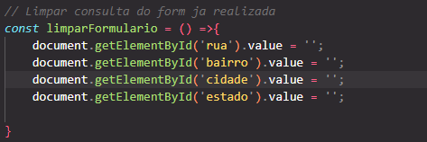
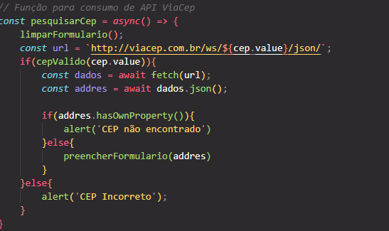

## Consulta CEP ViaCEP - JavaScript

# Descrição:
Este código JavaScript implementa uma funcionalidade de consulta de CEP utilizando a API do ViaCEP. Ao inserir um CEP válido em um campo de formulário, o script busca as informações correspondentes no banco de dados do ViaCEP e preenche automaticamente os campos de rua, bairro, cidade e estado.

Funcionalidades:
Validação de CEP: Verifica se o CEP inserido possui 8 dígitos numéricos.
Consulta à API ViaCEP: Realiza uma requisição à API do ViaCEP para obter as informações do endereço.
Preenchimento automático do formulário: Preenche os campos do formulário com as informações retornadas pela API.
Limpeza do formulário: Limpa os campos do formulário antes de realizar uma nova consulta.
Mensagem de erro: Exibe uma mensagem de erro caso o CEP seja inválido ou não seja encontrado.
Como utilizar:
Incluir o código: Copie e cole o código JavaScript em um arquivo HTML.
Criar o formulário: Crie um formulário HTML com os campos cep, rua, bairro, cidade e estado.
Associar o evento: Associe o evento focusout ao campo cep para que a função pesquisarCep seja chamada quando o campo perder o foco.
Exemplo de HTML:

# Exemplo com imagens

 

 

HTML

<!DOCTYPE html>
<html>
<head>
    <title>Consulta CEP</title>
</head>
<body>
    <form>
        <label for="cep">CEP:</label>
        <input type="text" id="cep" name="cep">
         
        <label for="rua">Rua:</label>
        <input type="text" id="rua" name="rua" disabled>
         
        </form>
    
</body>
</html>

 

# Explicação do Código:
***use strict: Ativa o modo restrito do JavaScript, * evitando erros comuns e facilitando a depuração. *
limparFormulario: Limpa os campos do formulário antes de realizar uma nova consulta.
eNumero: Verifica se uma string contém apenas dígitos numéricos utilizando uma expressão regular.
cepValido: Verifica se o CEP possui 8 dígitos numéricos.
preencherFormulario: Preenche os campos do formulário com as informações do endereço.
pesquisarCep:
Limpa o formulário.
Verifica se o CEP é válido.
Realiza uma requisição à API do ViaCEP.
Verifica se o endereço foi encontrado.
Preenche o formulário ou exibe uma mensagem de erro.***
 

addEventListener: Associa o evento focusout ao campo cep para chamar a função pesquisarCep.
Observações:
API ViaCEP: Certifique-se de que a API do ViaCEP esteja disponível e funcionando corretamente.
Async/Await: O código utiliza async/await para lidar com requisições assíncronas de forma mais clara.
Expressões Regulares: A expressão regular ^[0-9]+$ é utilizada para validar se uma string contém apenas dígitos numéricos.
Propriedade hasOwnProperty: É utilizada para verificar se o objeto retornado pela API possui dados, indicando que o CEP foi encontrado.
Melhorias Possíveis:
Tratamento de erros: Implementar um tratamento de erros mais robusto para lidar com situações como falhas na conexão com a API.
Interface do usuário: Melhorar a interface do usuário com mensagens mais claras e feedback visual.

# Autor
## Felipe André de Freitas Loução