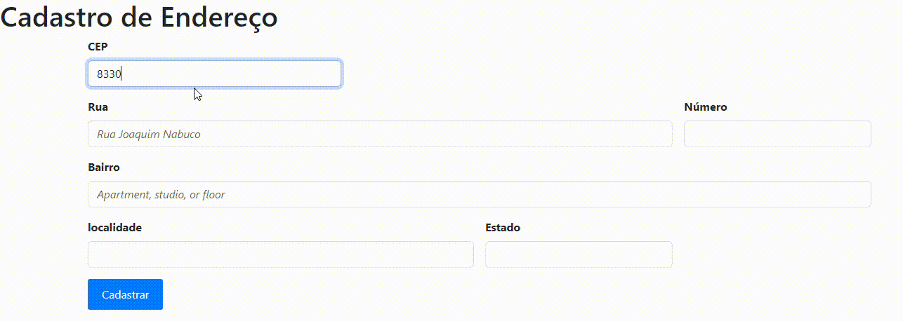

## Consulta CEP ViaCEP - JavaScript

# Descrição:
Este código JavaScript implementa uma funcionalidade de consulta de CEP utilizando a API do ViaCEP. Ao inserir um CEP válido em um campo de formulário, o script busca as informações correspondentes no banco de dados do ViaCEP e preenche automaticamente os campos de rua, bairro, cidade e estado.

Funcionalidades:
Validação de CEP: Verifica se o CEP inserido possui 8 dígitos numéricos.
Consulta à API ViaCEP: Realiza uma requisição à API do ViaCEP para obter as informações do endereço.
Preenchimento automático do formulário: Preenche os campos do formulário com as informações retornadas pela API.
Limpeza do formulário: Limpa os campos do formulário antes de realizar uma nova consulta.
Mensagem de erro: Exibe uma mensagem de erro caso o CEP seja inválido ou não seja encontrado.
Como utilizar:
Incluir o código: Copie e cole o código JavaScript em um arquivo HTML.
Criar o formulário: Crie um formulário HTML com os campos cep, rua, bairro, cidade e estado.
Associar o evento: Associe o evento focusout ao campo cep para que a função pesquisarCep seja chamada quando o campo perder o foco.
Exemplo de HTML:

# Exemplo com imagens

 
***limparFormulario:*** Limpa os campos do formulário antes de realizar uma nova consulta.

 
***preencherFormulario:*** Preenche os campos do formulário com as informações do endereço.

 
***pesquisarCep:*** Executa código para mostrar as informações do CEP.

# Explicação do Código:
***use strict: Ativa o modo restrito do JavaScript, * evitando erros comuns e facilitando a depuração.***

eNumero: Verifica se uma string contém apenas dígitos numéricos utilizando uma expressão regular.
cepValido: Verifica se o CEP possui 8 dígitos numéricos.
Limpa o formulário.
Verifica se o CEP é válido.
Realiza uma requisição à API do ViaCEP.
Verifica se o endereço foi encontrado.
*Preenche o formulário ou exibe uma mensagem de erro.*
 

addEventListener: Associa o evento focusout ao campo cep para chamar a função pesquisarCep.
Observações:
API ViaCEP: Certifique-se de que a API do ViaCEP esteja disponível e funcionando corretamente.
 

Async/Await: O código utiliza async/await para lidar com requisições assíncronas de forma mais clara.
 

Expressões Regulares: A expressão regular ^[0-9]+$ é utilizada para validar se uma string contém apenas dígitos numéricos.
 

Propriedade hasOwnProperty: É utilizada para verificar se o objeto retornado pela API possui dados, indicando que o CEP foi encontrado.
 

Tratamento de erros: Implementar um tratamento de erros mais robusto para lidar com situações como falhas na conexão com a API.
 

Interface do usuário: Melhorar a interface do usuário com mensagens mais claras e feedback visual.
 

## Tecnologias Utilizadas
* [<code></code>](https://developer.mozilla.org/pt-BR/docs/Web/HTML)
* [<code></code>](https://git-scm.com/)
* [<code></code>](https://code.visualstudio.com/)
* [<code></code>](https://github.com/)
* [<code></code>](https://developer.mozilla.org/pt-BR/docs/Web/JavaScript)
* [<code></code>](https://developer.mozilla.org/pt-BR/docs/Web/CSS)
tem menu de contexto

tem menu de contexto

# Autor
## Felipe André de Freitas Loução